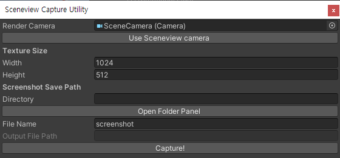

# Screen Capture Utility

이 패키지는 인게임 스크린샷을 해상도 별로 추출해내기 위해 만들어진 패키지입니다.

## Usage
유니티 에디터의 `Tools`→`Screen capture utility` 메뉴 클릭 시 아래와 같은 유틸리티 패널이 표시됩니다.

각 설정 값들은 아래와 같습니다.
- `Render Camera`: 현재 열려있는 씬에 존재하는 카메라 레퍼런스입니다.
- `Use Sceneview camera`: 현재 열려있는 `Scene view`의 렌더 카메라를 캡쳐용 렌더 카메라로 설정합니다.
- `Texture Size`: 추출될 스크린샷 텍스쳐의 사이즈입니다(픽셀 단위).
- `Directory`: 스크린샷이 저장될 폴더의 위치입니다. `Open Folder Panel` 버튼을 클릭하면 폴더뷰가 표시됩니다.
- `File Name`: 저장될 스크린샷의 이름 접두사입니다.
- `Output File Path`: `Directory`와 `File Name`에 입력된 내용을 기준으로 생성된 유효한 파일 디렉토리를 표시합니다.
- `Capture!`: 현재 설정된 값을 기준으로 스크린샷을 생성합니다.

> 위 유틸리티 창에서 입력된 값이 유효하다면, 결과물은 `Output File Path`에 표시된 위치에 저장됩니다.

## Note
- 추후 현재 상용화된 디바이스 해상도를 지정 할 수 있는 프리셋 데이터 적용기능을 추가 할 예정입니다.
    - 내부적으로 데이터는 추가되어있으니, `ScreenViewCapture/Editor/ScreenViewCapture.cs`의 내용물을 확인하시면 됩니다.